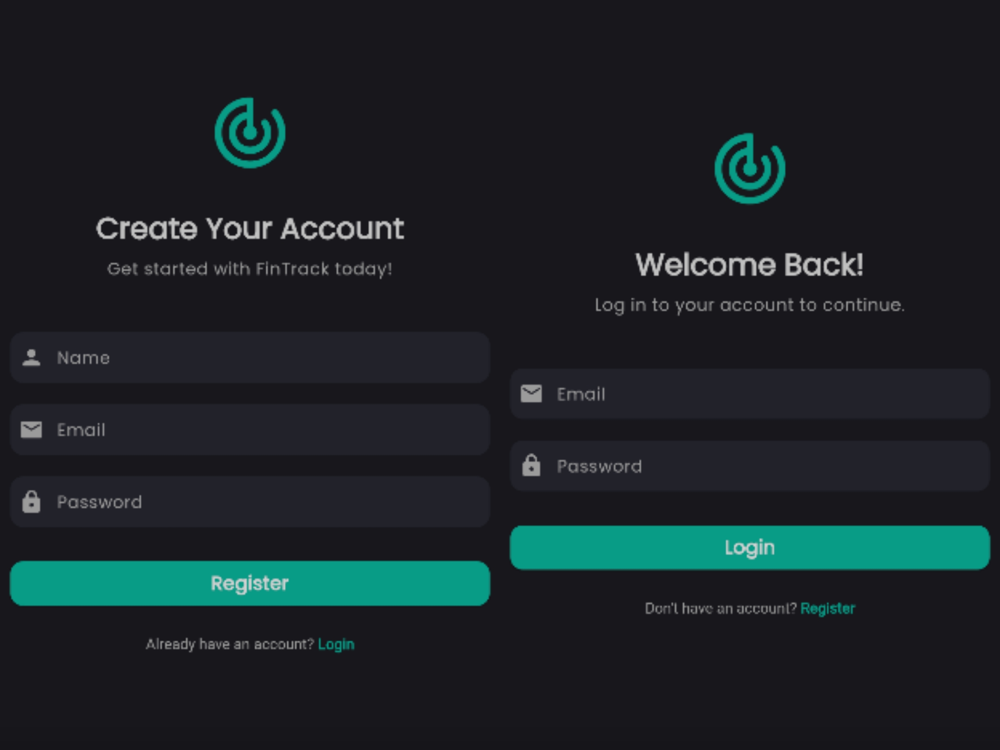
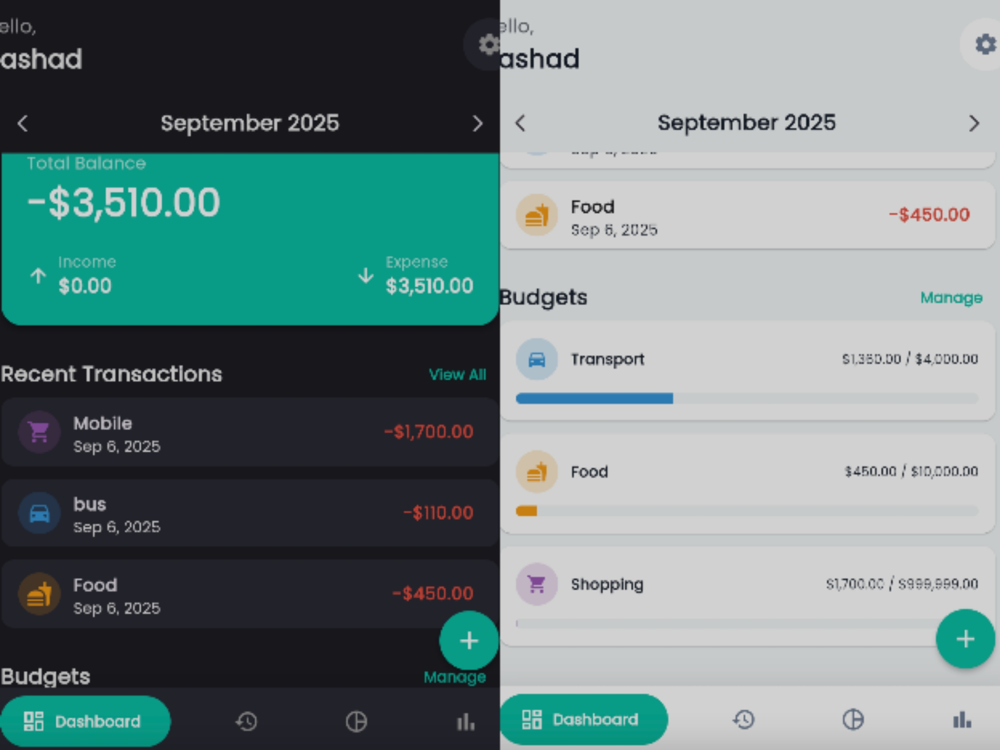
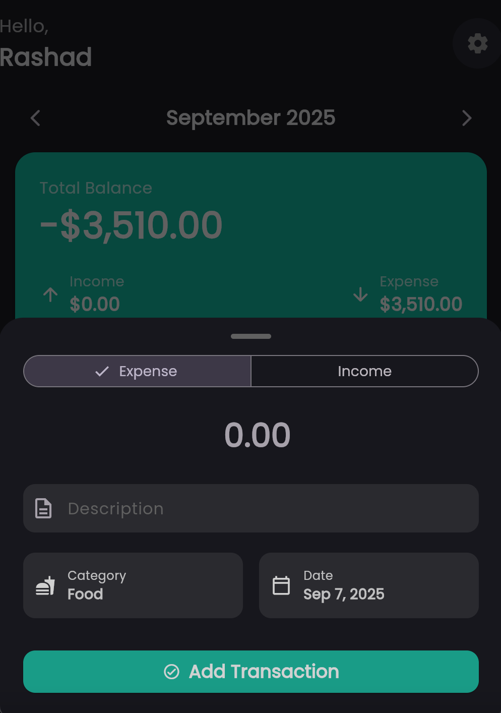
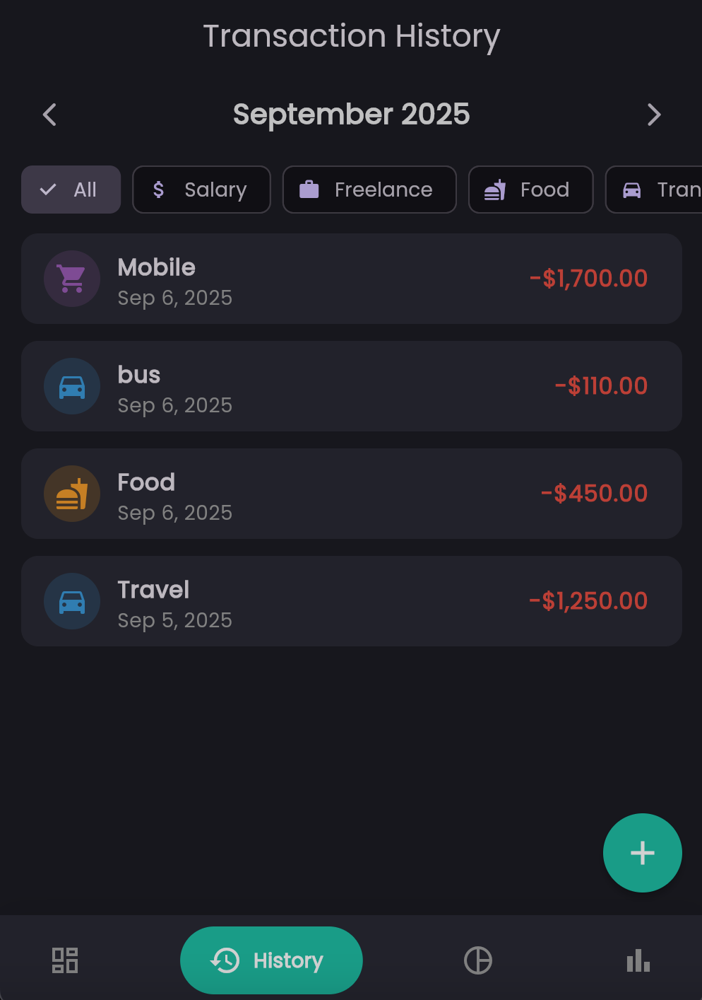
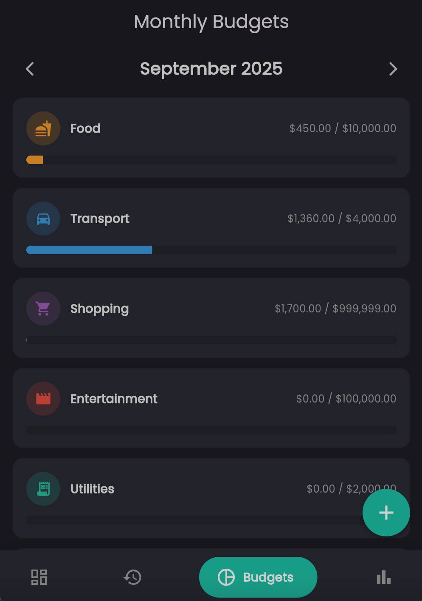
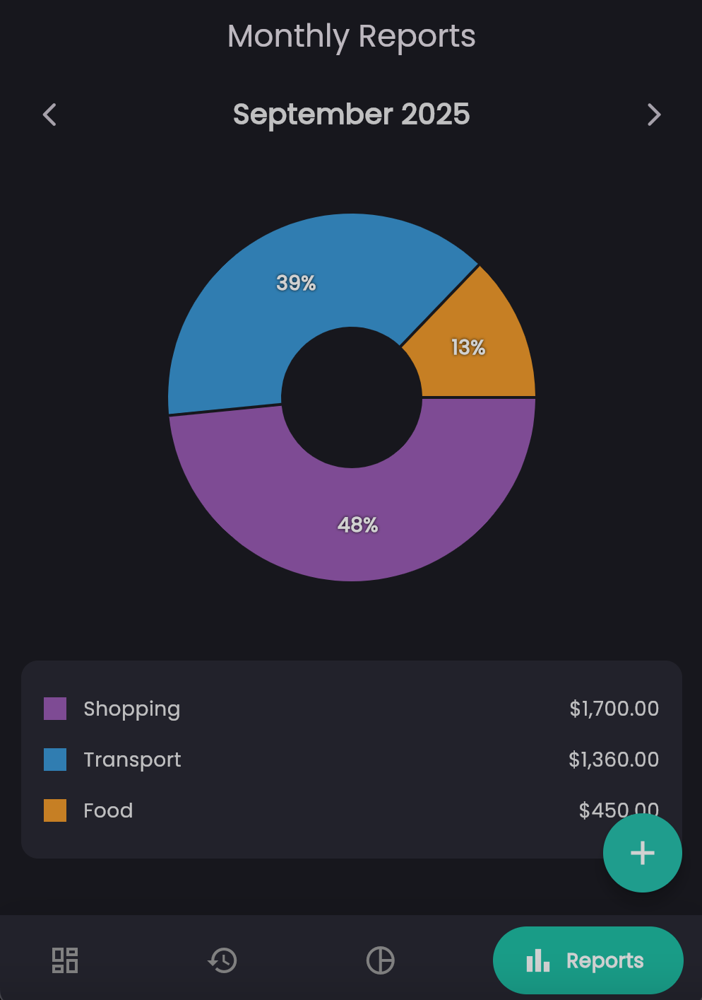

# FinTrack: Personal Finance Tracker 💸

A modern, intuitive, and cross-platform personal finance tracker built with Flutter and Firebase. FinTrack empowers users to take control of their financial life with a clean interface, real-time data synchronization, and powerful insights.

---

## Table of Contents

- [About The Project](#about-the-project)
- [Key Features](#key-features)
- [App Showcase (Screenshots)](#app-showcase-screenshots)
- [Tech Stack](#tech-stack)
- [Getting Started (Setup Instructions)](#getting-started-setup-instructions)
    - [Prerequisites](#prerequisites)
    - [Installation](#installation)
- [User Manual (How To Use)](#user-manual-how-to-use)
- [Future Improvements](#future-improvements)
- [License](#license)
- [Contact](#contact)

---

## About The Project

Managing personal finances can be complex and overwhelming. FinTrack was developed to simplify this process, providing a seamless and enjoyable experience for tracking income, expenses, and budgets. Built with a mobile-first approach using Flutter, the app offers a native-like performance on both iOS and Android from a single codebase. By leveraging Firebase, all data is synced in real-time across devices, ensuring your financial information is always up-to-date and secure.

The core design philosophy is centered around clarity and intuition, helping users to not only track their money but also to understand their spending habits through beautiful charts and reports.

---

## Key Features

-   🔐 **Secure User Authentication**: Simple and secure registration and login using Firebase Authentication (Email/Password).
-   📊 **Interactive Dashboard**: A dynamic, at-a-glance overview of your financial status for any given month, including total balance, income, and expenses.
-   💸 **Effortless Transaction Management**:
    -   Quickly add income or expense transactions through a modern, intuitive form.
    -   Edit existing transactions with ease.
    -   Delete transactions with a simple swipe and confirmation.
-   🎯 **Monthly Budget Planning**: Set monthly spending goals for various categories and visually track your progress in real-time.
-   📈 **Insightful Reports**: A beautiful, interactive pie chart that visualizes your spending breakdown by category for any month.
-   🔍 **Advanced Filtering**: Filter your transaction history by month and category to easily find what you're looking for.
-   🌓 **Dual Theme Support**: A stunning, modern UI that works beautifully in both Light and Dark modes.
-   📱 **Cross-Platform**: Natively compiled for both iOS and Android.

---

## App Showcase (Screenshots)

<!-- TODO: Replace the placeholder links below with links to your actual screenshots. You can upload them to the "issues" section of your GitHub repo to get a link, or use a service like Imgur. -->

| Onboarding (Auth)                 | Dashboard (Light & Dark)              | Add Transaction                       |
|-----------------------------------|---------------------------------------|---------------------------------------|
|  |  |  |

| Transaction History & Filters          | Monthly Budgets                   | Reports & Charts                  |
|----------------------------------------|-----------------------------------|-----------------------------------|
|  |  |  |

---

## Tech Stack

This project is built with a modern, scalable tech stack:

-   **Frontend:**
    -   [Flutter](https://flutter.dev/) - Google's UI toolkit for building natively compiled applications.
    -   [Dart](https://dart.dev/) - The programming language used by Flutter.
-   **Backend & Database:**
    -   [Firebase](https://firebase.google.com/) - A comprehensive app development platform by Google.
    -   [Firebase Authentication](https://firebase.google.com/docs/auth) - For handling user accounts.
    -   [Cloud Firestore](https://firebase.google.com/docs/firestore) - A flexible, scalable NoSQL cloud database for real-time data syncing.
-   **State Management:**
    -   [Provider](https://pub.dev/packages/provider) - For simple, effective state management (e.g., theme switching).
-   **UI & Charting Packages:**
    -   `fl_chart` - For creating beautiful and interactive charts.
    -   `google_nav_bar` - For a modern, intuitive navigation experience.
    -   `intl` - For date and number formatting.

---

## Getting Started (Setup Instructions)

Follow these steps to get a local copy of the project up and running.

### Prerequisites

Make sure you have the following tools installed on your machine:
-   [Flutter SDK](https://flutter.dev/docs/get-started/install) (Version 3.0 or higher)
-   A code editor like [VS Code](https://code.visualstudio.com/) or [Android Studio](https://developer.android.com/studio)
-   [Firebase CLI](https://firebase.google.com/docs/cli#install-cli-mac-linux)
-   [FlutterFire CLI](https://firebase.google.com/docs/flutter/setup?platform=ios#install-cli)

### Installation

1.  **Clone the Repository**
    ```bash
    git clone https://github.com/rashadamd/fintrack.git
    cd fintrack
    ```

2.  **Create and Configure a Firebase Project**
    -   Go to the [Firebase Console](https://console.firebase.google.com/) and click "Add project".
    -   Follow the steps to create a new project.
    -   **Enable Authentication:** In your project's dashboard, go to *Build > Authentication > Sign-in method* and enable the **Email/Password** provider.
    -   **Enable Firestore:** Go to *Build > Firestore Database* and create a new database. Start in **Test mode** for easy setup.

3.  **Connect Your Flutter App to Firebase**
    -   Log in to Firebase using your terminal:
        ```bash
        firebase login
        ```
    -   From the root of your project folder (`fintrack/`), run the FlutterFire configure command:
        ```bash
        flutterfire configure
        ```
    -   Follow the interactive prompts to select your Firebase project and the platforms you wish to support (iOS/Android). This will automatically generate the `lib/firebase_options.dart` file.

4.  **Install Dependencies**
    ```bash
    flutter pub get
    ```

5.  **Run the Application**
    ```bash
    flutter run
    ```
    The app should now build and run on your selected emulator or physical device.

---

## User Manual (How To Use)

1.  **Onboarding**: The first time you open the app, you will be prompted to **Register** for a new account using your name, email, and a password. If you already have an account, you can easily switch to the **Login** page.
2.  **The Dashboard**: After logging in, you'll see your dashboard. This is your financial command center for the current month. You can cycle through previous and future months using the arrow buttons.
3.  **Adding a Transaction**: Tap the large `+` button in the bottom navigation bar. A modern form will slide up. Fill in the amount, select a category, add a description, and choose a date to record your income or expense.
4.  **Managing Budgets**: Navigate to the "Budgets" tab. Here, you can see all your expense categories. Tap on any category to set or edit its monthly budget limit.
5.  **Viewing Reports**: Go to the "Reports" tab to see a beautiful pie chart of your spending for the selected month. This helps you quickly identify where your money is going.
6.  **Editing & Deleting**: In the "History" tab, you can **tap** any transaction to open the edit form or **swipe it from right to left** to reveal the delete option.

---

## Future Improvements

While the core functionality is complete, there are many exciting features that could be added in the future:

-   [ ] Push notifications for budget alerts.
-   [ ] Support for multiple accounts (e.g., cash, bank, credit card).
-   [ ] Data export to CSV.
-   [ ] More advanced analytics and trend charts.
-   [ ] Recurring transactions.

---

## License

Distributed under the MIT License. See `LICENSE` for more information.

---

## Contact

Rashad Ahamed - [nameisrashad@gmail.com](mailto:nameisrashad@gmail.com)

Project Link: [https://github.com/rashadamd/fintrack.git](https://github.com/rashadamd/fintrack.git)

<!-- TODO: Replace the placeholder name, email, and project link with your own. -->
